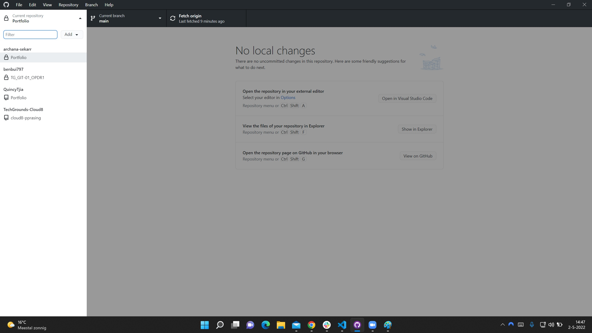

Date 2 mei 2022
# Question subject
- what is Git, Github and Visual Studio 
- how do you invite colleques
- how does cloning work to github desktop and visual studio 
 
## Key terminology
- Git = CLI
- Github = online platform for developers to share the program among others with versioning
- Visual Studio Code = editor 
- push = put the changes online 
- pull = download the changes to the local drive
- Repository = for organizing a project with files and directories
- Main / Master = top of the all the branches where the code will finally go to 
- Branch = part of the tree where a certain part of the project will be coded or worked on
- Commit = similar as saving a file that has been changed. every change has a new hash
- Merge = all the commit will be merged into a single commit and merged into the master
- Fork = a copy of a repository that you want to manage or update

### Sources
https://www.w3schools.com/git/default.asp

### Overcome challanges
how to push and pull changes from visual studio to desktop and upload it online

### Results
this is a screenshot of the shared access of eachothers repositories

this is a screenshot of the cloning to local

