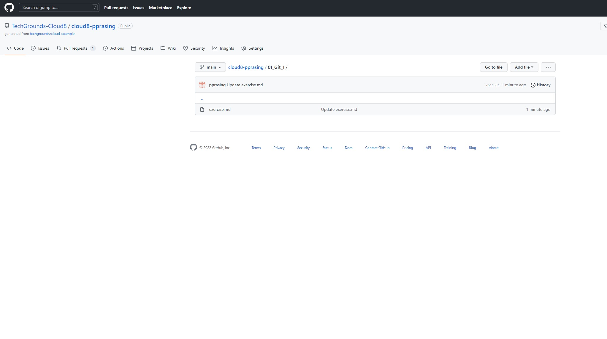

# [GIT-02 Markdown]
find out what a markdown language is

## Key terminology
Markdown = language that is used
WYSIWYG vs WYSIWYM = in a regular programming language you program the layout but with this markdown you just write it as you want to have it and the program will make the code

## Exercise
### Sources
google.com
Obsidian.md
search ghostwriter on google
typora.io

### Overcome challanges
looking for the difference in the program/platforms

### Results
this is a screenshot 

