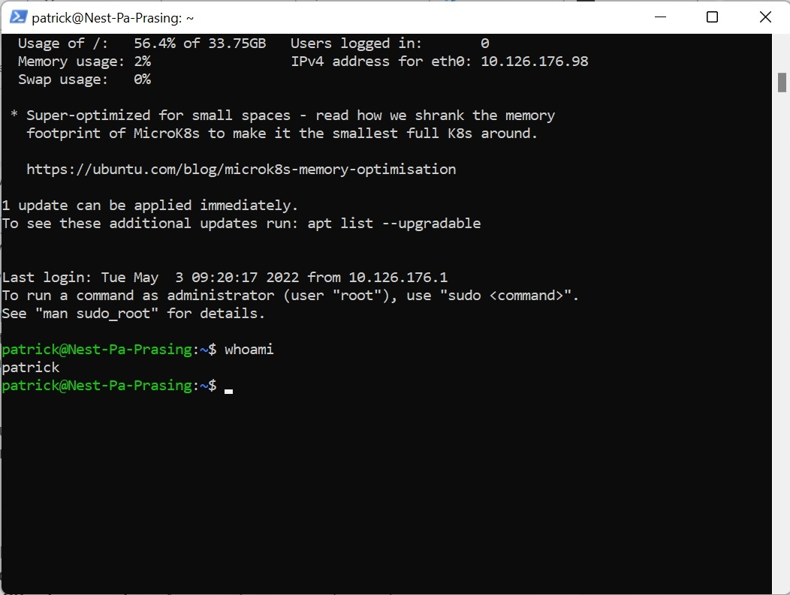

# [LNX-01 Setting Up]
make a ssh connection with my server on techgrounds, look up the public key in the email and change the permissions for this file

## Key terminology
- pem file = a file where the keys (password) is stored 
- ssh = shell command to talk to a server

## Exercise
### Sources
- https://docs.microsoft.com/en-us/windows-server/administration/openssh/openssh_install_firstuse
- https://www.digitalocean.com/community/tutorials/how-to-set-up-ssh-keys-on-ubuntu-1804#copying-public-key-using-ssh-copy-id
- https://www.howtogeek.com/devops/how-to-add-your-ec2-pem-file-to-your-ssh-keychain/

### Overcome challanges
[Give a short description of your challanges you encountered, and how you solved them.]
the problem first was to put the pem file in the working directory
change the permissions with chmod 400
finally run the command ssh -i access_key.pem patrick@18.196.32.244 -p55210

### Results
this is a screenshot 

