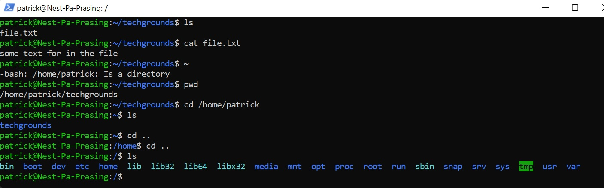

# [LNX-02 Files and directories]
We need to be able to navigate thru the directories and know how to make a file and edit this file

## Key terminology
- pwd = Print working directory, show the directory that your working in 
- absolute path = the path that the file is in , seen from the actual file system hierarchy
- relative path = the path that the file is in , seen from the working directory that has been setup

## Exercise
### Sources
- https://phoenixnap.com/kb/how-to-create-a-file-in-linux#ftoc-heading-5
- https://www.linux.com/training-tutorials/absolute-path-vs-relative-path-linuxunix/

### Overcome challanges
- Search for the command to look find the working directory
- how to navigate in the directories
- what is the difference between a absoluth and relative path

### Results
here is a screenshot of the techground directory made and the file within with some text 

