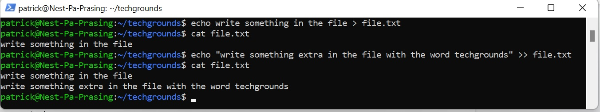
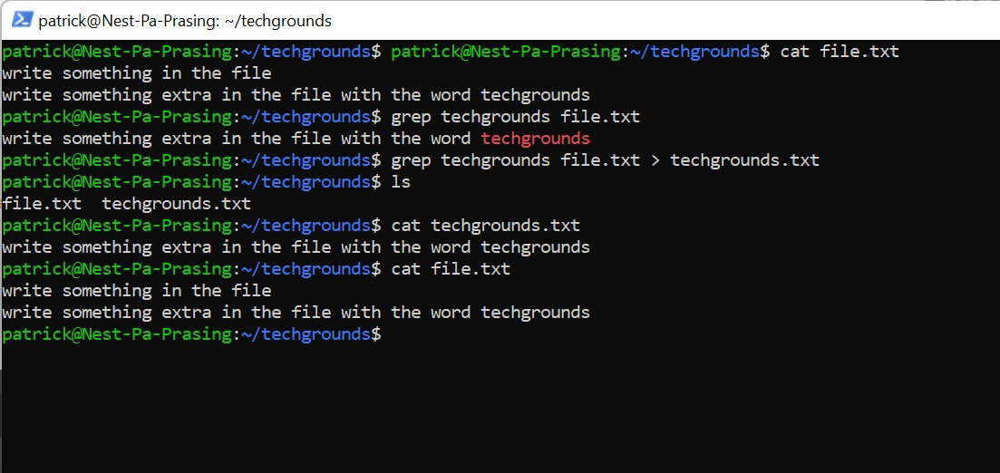

# [Working with text (CLI)]
Create a text file and search for a specfic word in a sentence. Then place this sentence in a new text document

## Key terminology
- echo = create a string of text on the screen or write this to a file
- touch = create a file
- cat = print the text in a file to the screen
- grep = search for a specific line of text 

## Exercise
### Sources
- https://stackoverflow.com/questions/17115664/can-linux-cat-command-be-used-for-writing-text-to-file 
- https://phoenixnap.com/kb/how-to-create-a-file-in-linux#ftoc-heading-5
- https://linuxconfig.org/how-to-find-a-string-or-text-in-a-file-on-linux
- https://www.youtube.com/watch?v=qWKK_PNHnnA&t=6s

### Overcome challanges
how can i add a new line to the file without beeing overwritten , using "" >> file.txt instead of "" > file.txt
what command is used to search for a specific word in a file and how to use it

### Results
Here is a screenshot of using the echo command and using >> to add text to the end of the file

Here is a screenshot of looking for a word in the file and then placing the line of text where the word is in a new textfile with the command grep

