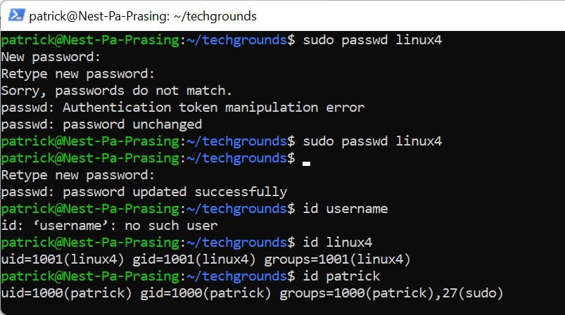
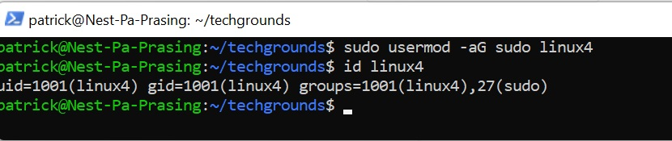
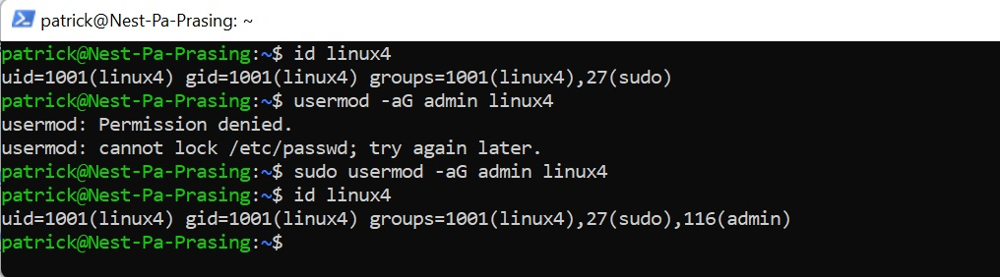
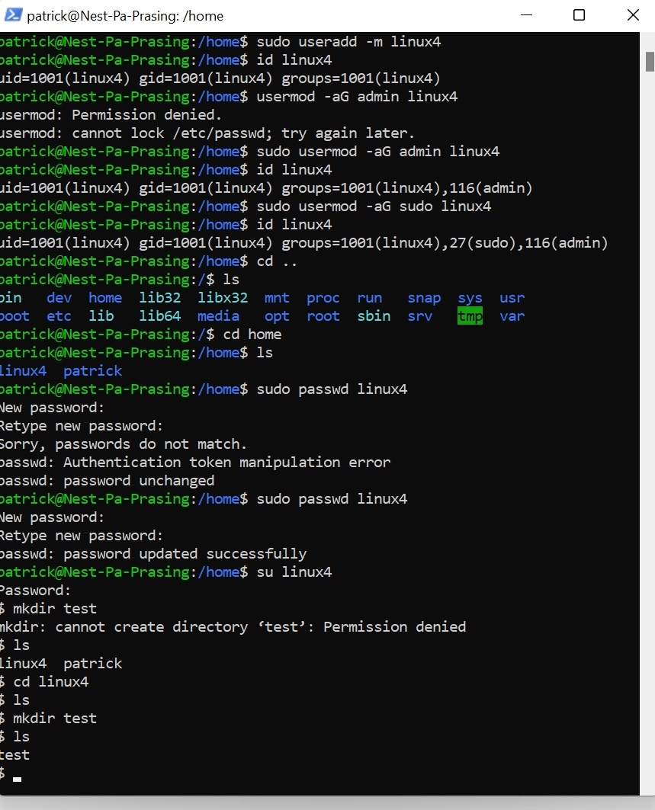
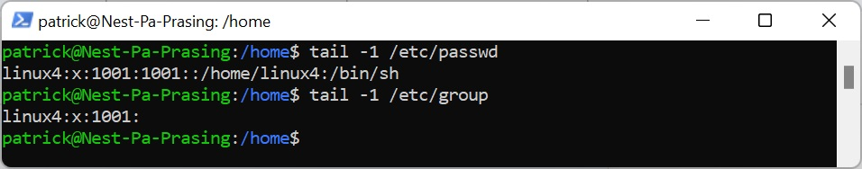

# [Users and groups]
We need to make a new user that is in a admin group and is able to use the root command

## Key terminology
- useradd = add a new user
- usermod = make modifications on useraccount
- tail = show last line in search -1, show last2 -2

## Exercise
### Sources
- https://www.pluralsight.com/blog/tutorials/linux-add-user-command
- https://linuxize.com/post/how-to-create-users-in-linux-using-the-useradd-command/
- https://www.cyberciti.biz/faq/add-new-user-account-with-admin-access-on-linux/#:~:text=Open%20the%20terminal%20application,run%3A%20usermod%20%2DaG%20sudo%20marlena 

### Overcome challanges
- what is the command for adding a new user -> adduser
- how can i get the directory of the user -> adduser -m
- changing the password with -> sudo passwd [username]
- how can i add a user to a group
- where are the files stored of the users , passwords and groups

### Results
Here is a screenshot of the new user [linux4] beeing created and set with a new password. You can also see here that patrick can use sudo an user linux4 not

Here is a screenshot of forcing with sudo usermod to change the user to be able to user sudo

Here is a screenshot of placing user linux4 in the admingroup and checking this with the id command

Here is a screenshot of a user in admin group with sudo rights tested in linux4 useraccount with "test" directory

 show command to see the last added userdata and groups
