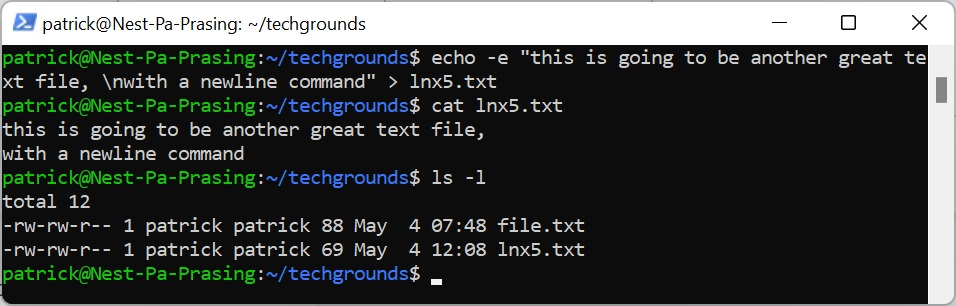
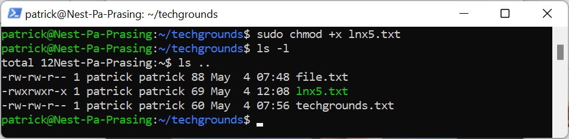
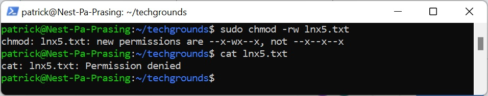
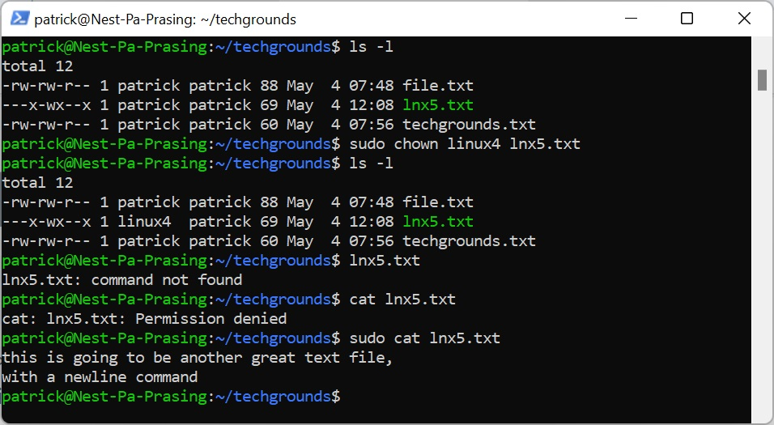
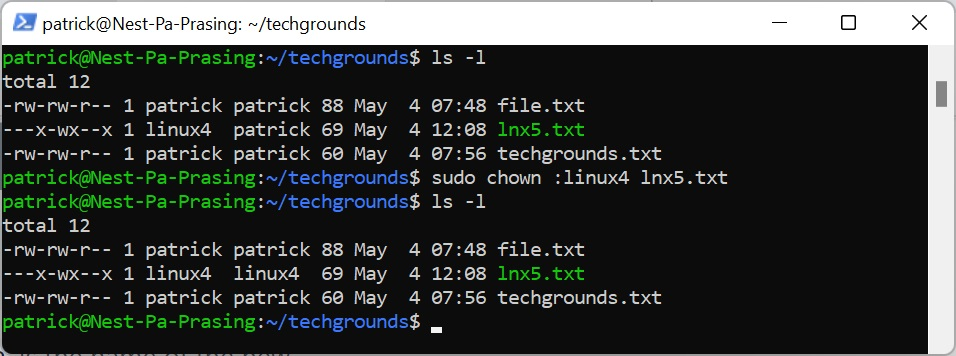

# [File permissions]
In this exercise i had the opportunity to play with permissions of files , changing permissions for files and groups

## Key terminology
- ls -l = show a list on long format
- chmod = a way to change the permissions
- chown = change the owner of a file or group
    - [:group] with : to change the group

## Exercise
### Sources
- https://sites.google.com/site/tipsandtricksforubuntu/executable-files
- https://frameboxxindore.com/linux/how-do-i-remove-read-permissions-in-unix.html
- https://linuxize.com/post/linux-chown-command/ 

### Overcome challanges
how can you change the permissions of files and change owners of files

### Results
here is a screenshot of creating a new file and see what the permissions are of this file

here is a screenshot of adding executing permissions to the file

here is a screenshot of deleting read and writing  permissions to the file, you can also see that i cannot open the file for reading

here is a screenshot of changing the owner to user linux4 and that is only accessible with sudo user

here is a screenshot of changing the group to group linux4 
