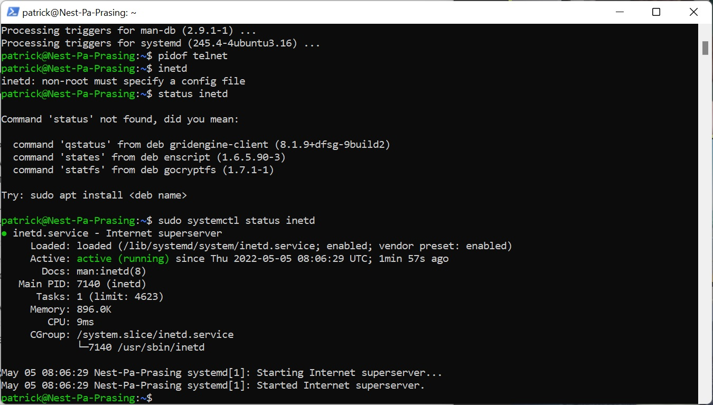

# [Processes]
Telnet is the first way of communicating, but is not secure. Instead it would be better to use for example powershell, while this is secure

## Key terminology
- PID = process identification number , each command is interpreted by the system as a new process

## Exercise
### Sources
- https://windowscmd.com/telnet-command/

### Overcome challanges
- install telnet client on windows
- somehow cannot connect to a telnet server and that's why i cannot run the command pidof telnet. so i looked it up in the windows UI

### Results
Here you can find a screenshot of the PID and the amount of memory it's using

here is another screenshot
