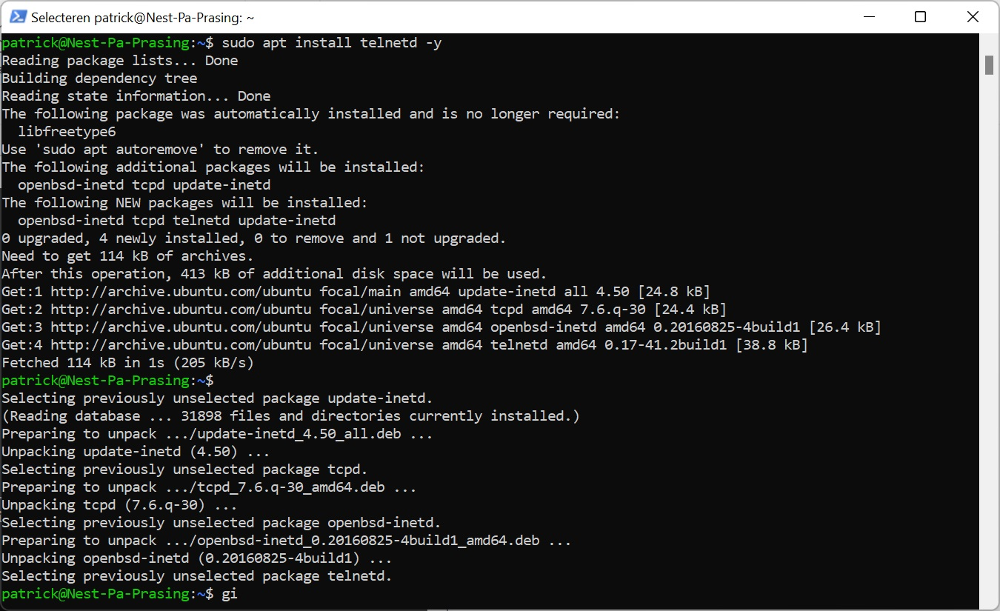
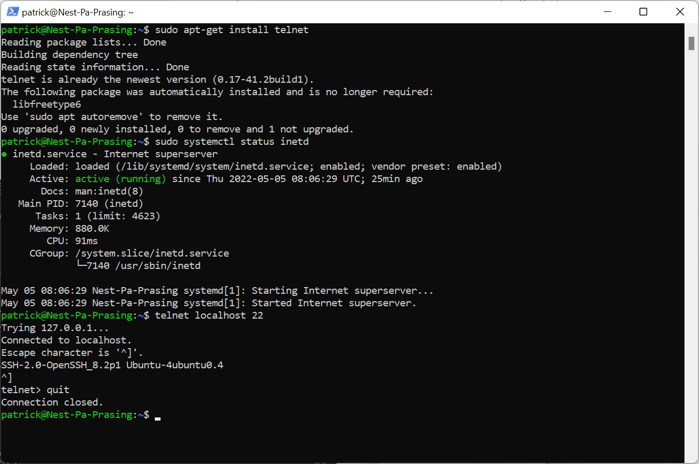

# [Processes]
I need to install telnet on the techground server, make a connection and see what the PID is. i should also know how to close it
Telnet is an old way of communicating to a server, but is not secure. Instead it would be better to use for example powershell, while this is secure

## Key terminology
- PID = process identification number , each command is interpreted by the system as a new process
- telnet = old way of communicating to a server

## Exercise
### Sources
- https://windowscmd.com/telnet-command/
- https://www.layerstack.com/resources/tutorials/Installing-telnet-on-Linux-and-Windows-Cloud-Servers#Ubuntu&Debian

### Overcome challanges
- apparantly i first installed telnet client on my personal windows machine. this was not supposed to be done. Then i locked in my techgrounds account and installed telnet

### Results
here is another screenshot

Here you can find a screenshot of the PID and the amount of memory it's using

here is another screenshot

