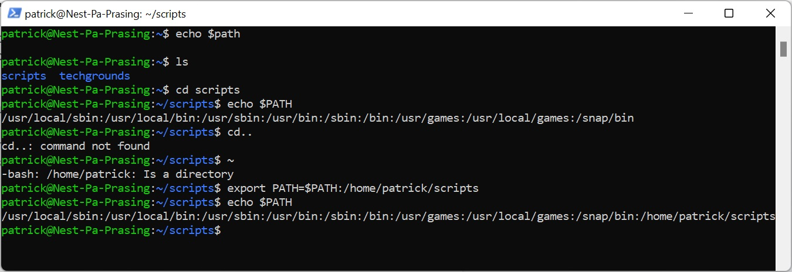
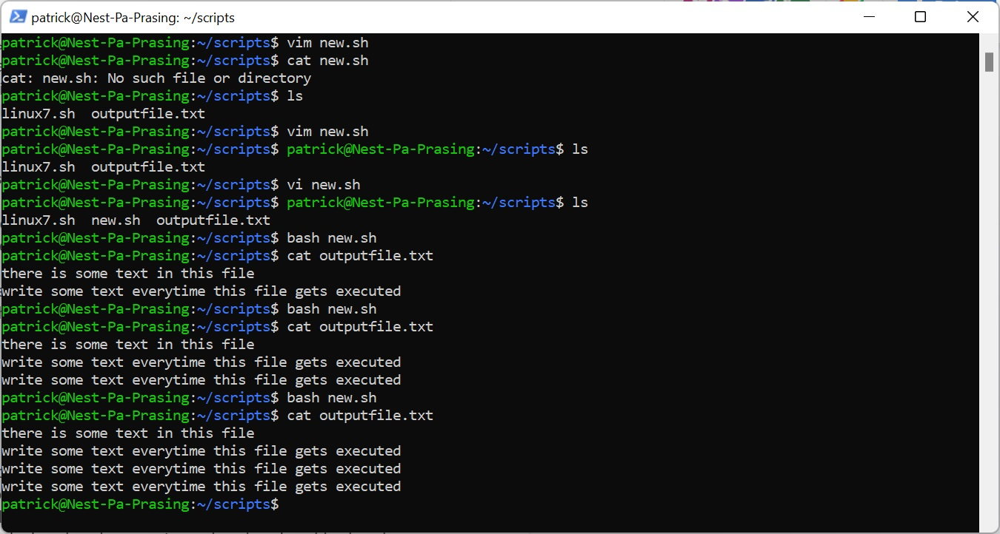
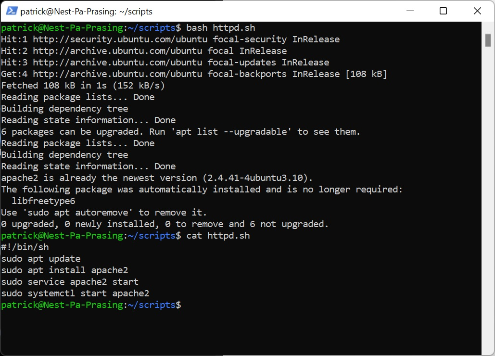
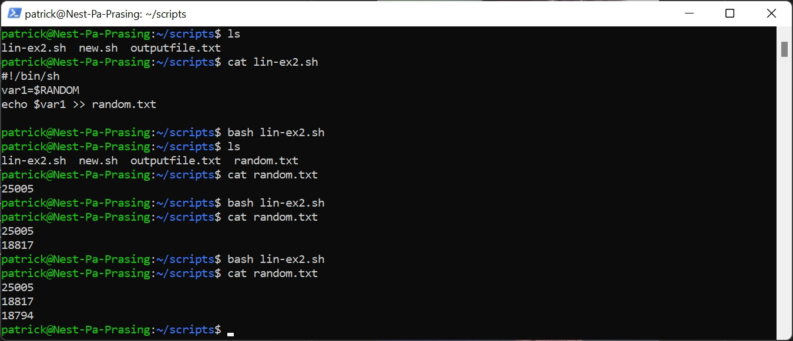
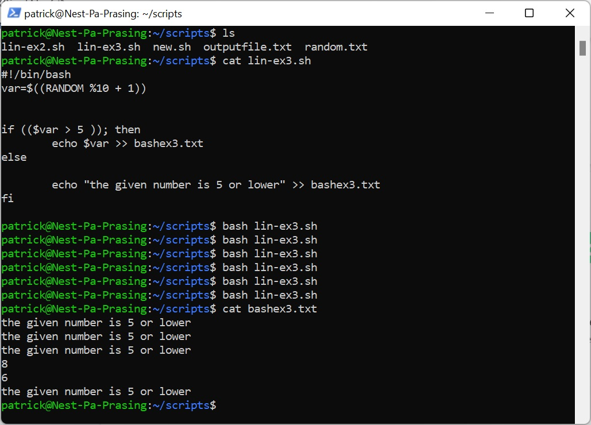

# [Bash scripting]
in this exercise we get a little peak of what bash is and trying to make a scriptfile. Also using conditions for what to write to a file.

## Key terminology
- BASH = (Bourne Again Shell) is a shell where you can use a scripting language
- PATH variable = is a variable that can be recalled to look for a certain file that is beeing called
- vim = text editor where you can write your code in
- shebang = tell the script by what program is has to run

## Exercise
### Sources
- https://www.baeldung.com/linux/path-variable
- https://www.guru99.com/introduction-to-shell-scripting.html 
- https://www.geeksforgeeks.org/random-shell-variable-in-linux-with-examples/#:~:text=Random%20integer%20can%20be%20generated,in%20range%200%20to%2032767.&text=You%20may%20use%20loops%20to,using%20the%20RANDOM%20shell%20variable.
- https://www.guru99.com/introduction-to-shell-scripting.html
- https://stackoverflow.com/questions/48216173/how-can-i-use-a-shebang-in-a-powershell-script
- https://httpd.apache.org/docs/2.4/install.html 
- https://www.tecmint.com/assign-linux-command-output-to-variable/
- https://www.unix.com/shell-programming-and-scripting/106254-ksh-random-number-between-1-10-a.html
- https://linuxize.com/post/bash-if-else-statement/
- https://phoenixnap.com/kb/how-to-vim-save-quit-exit

### Overcome challanges
- what is a PATH
- what editor to use
- how to create a variable and use it
- how to save and quit in VIM
- what is httpd and apache
- when to use () or [] in the if statement

### Results Exercise 1
Here is a screenshot of the directory scripts been made and then added to the $PATH variable

Here is a screenshot of a script made with vim that write an extra line to the file outputfile.txt everytime new.sh is run

here is a screenshot of the httpd.sh file installed 
\

### Results Exercise 2
Here is a screenshot of creating a script lin-ex2.sh where a random number gets stored in the variable var1 and placed in a new file random.txt. add/append the new number to a new line

### Results Exercise 3
Here is a screenshot of creating a random number put in a variabel and have certain conditions to dertermain what has to be put in the file 

