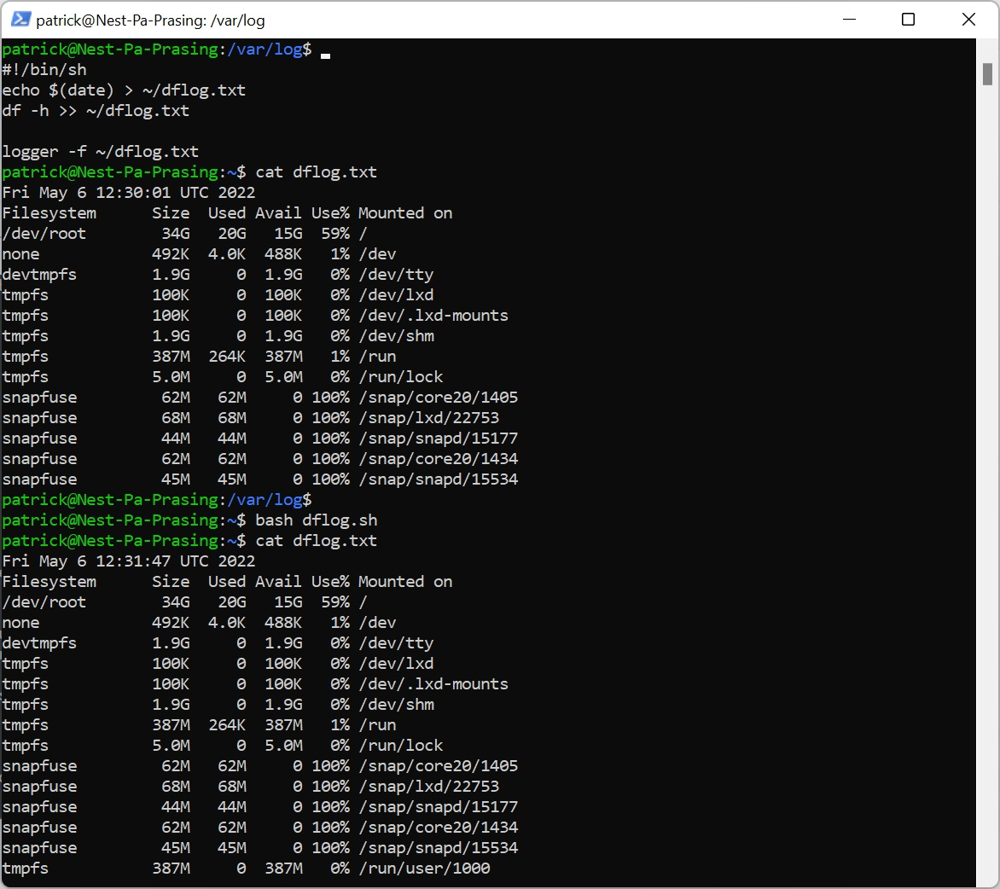

# [Cron jobs]
In this exercise  i got he opportunity to make another cronjob  for a log file

## Key terminology
- $(date) = the command to print the date to the screen
- ~ can use tilde to have shortcut to the home directory
- crontab = stands for cron table and uses the job scheduler cron to execute tasks (on certain times)
- crontab -l = list of all cronjobs
- crontab -e = edit cronjobs

## Exercise
### Sources
- https://www.cyberciti.biz/faq/unix-linux-getting-current-date-in-bash-ksh-shell-script/#:~:text=Sample%20shell%20script%20to%20display,scripts%20goes%20here%20%23%20
- https://www.geeksforgeeks.org/crontab-in-linux-with-examples/#:~:text=Crontab%20stands%20for%20%E2%80%9Ccron%20table,according%20to%20a%20set%20schedule
- https://crontab.guru/

### Overcome challanges
- how to write to a home directory, shortcut way is ~
- what is the command to write te date
- what is a crontab? 
- how to use the "every minute"
- couldn't find that i had to specify /bin/sh in the crontab, but with the help of my team i got it to work

### Results
Here is a screenshot how to write the date to a file in the home directory

Here is a screenshot of crontab -e

Here is a screenshot that a weekly cronjob is added to the cron list

Here is a screenshot of the script that the date and df -h commands are placed in a log file

Here is a screenshot of checking that the log is added to syslog with the command sudo cat syslog

Here is a screenshot of crontab -e

