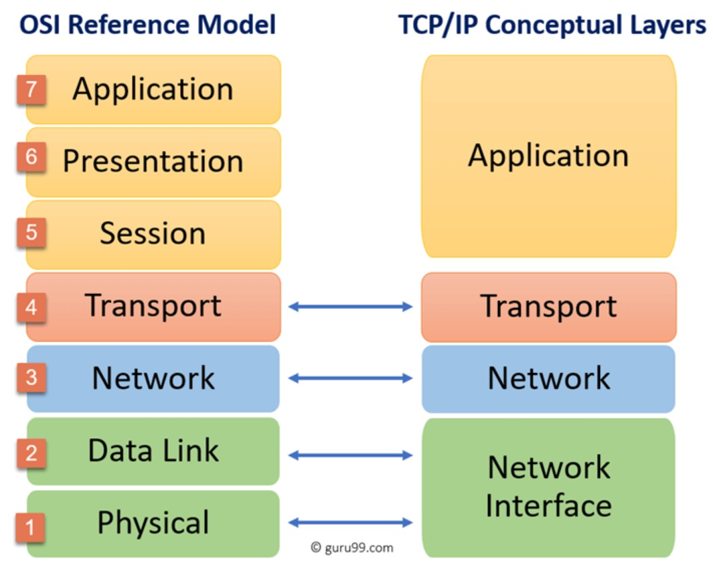

# [OSI Stack]
This is a learning exercise of what the OSI and TCP/IP model are and how they are build up.

## Key terminology
- OSI model (more theoretical) = The OSI Model is a guideline and method to learn how different network hosts communicate with each other over 7 different layers
    - Layer 7 Application Layer  
        The application layer is the user’s application like safari or chrome. Application layer consists of those protocols that establish a communication channel among your OS and your application. Example — HTTP, SMTP.
    - Layer 6 Presentation Layer  
        The presentation layer provides the conversion/translation of application data. This step is crucial as it ensures that the client’s application data will be understood by the server’s application layer.
    - Layer 5 Session Layer  
        The purpose of the session layer is to simply start, manage, terminate the connection between the sender and the receiver.
    - Layer 4 Transport Layer  
        The transport layer receives the data from the session layer and breaks it into packets and adds to them information headers like, the port number, the destination IP, and a sequence info so that the receiver can put the data back in order. Example protocols — TCP(transmission control protocol), UDP (user datagram protocol).
    - Layer 3 Network Layer  
        The network layer, dominated by the IP (Internet Protocol) is all about IP routing and IP addressing. Here the IP addresses of the sender and receiver is added to the packets.
    - Layer 2 Data Link Layer   
        adds the information like source and destination MAC (media access control) address to each packet corresponding to the NIC (network interface card). A trailer FCS (frame check sequence) is added to each packet and is converted into a frame. The NIC has a job of creating and destroying frames at sender and receiver end respectively.
    - Layer 1 Physical Layer  
        The physical layer receives the frames from the Data Link Layer and generates information on bits of electrical impulses or light depending on the medium being optical or electrical.

- TCP/IP model (more practical) = TCP/IP(Transmission Control Protocol/Internet Protocol) is a layered server architecture system in which each layer is defined according to a specific function to perform. All these four TCP IP layers work collaboratively to transmit the data from one layer to another.
    - Application Layer  
        allowing access to network resources
    - Transport Layer  
        to provide reliable process to process message and error delivery  
    - Internet Layer  
        to move packets from source destination and to provide internet working
    - Network Interface  
        responsible for the transmission of data between 2 devices on the same network

- TCP/IP model updated version includes an physical layer, so from the updated version the TCP-IP model is 5 layers instead of 4 layers. The biggest difference in 2 models would be in the top layers 5-7 in OSI compared to the application layer of TCP-IP 

- Top-down approach
    With this approach, we are going to start with the requirements of the organization, the technology that is needed, and then design it from the top-down. The application layer is the starting point, and the applications and services that are desperately needed are analyzed for their specific requirements first.

- Bottom-up approach
    This approach begins with the physical layer of the OSI model and works its way up. New, higher bandwidth links might be purchased, as well as new routers, switches, firewalls, etc. Designing a network with a bottom-up approach enables you to get your network set up much faster.

## Exercise
### Sources
- https://medium.com/networks-security/osi-model-1d5be9120b76
- https://www.cbtnuggets.com/blog/technology/networking/top-down-vs-bottom-up-network-design
- https://www.guru99.com/tcp-ip-model.html#:~:text=TCP%2FIP%20Model%20helps%20you,allow%20communication%20over%20large%20distances.
- https://www.youtube.com/watch?v=i9RL5jD9cTI

### Overcome challanges
- what is the OSI model
- What is the TCP/IP model

### Results
This is a learning exercise