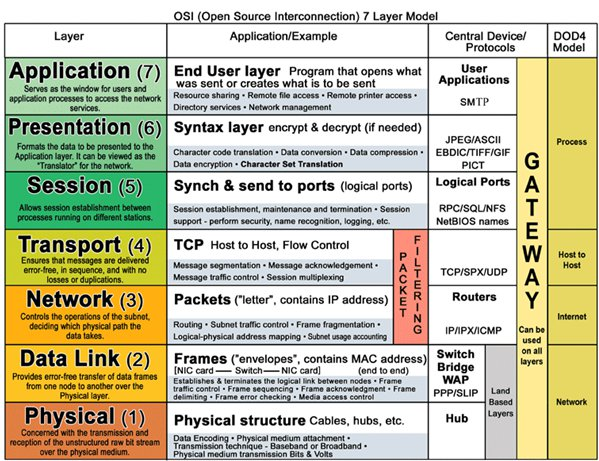
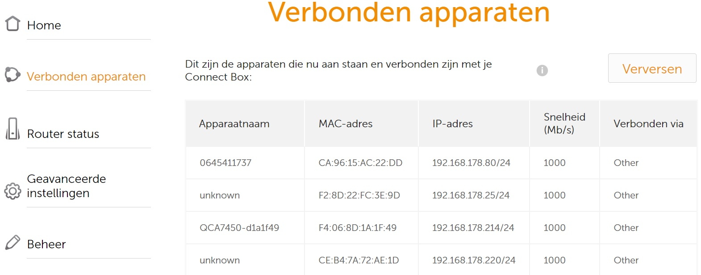
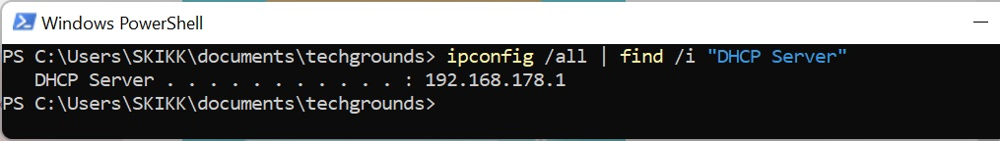
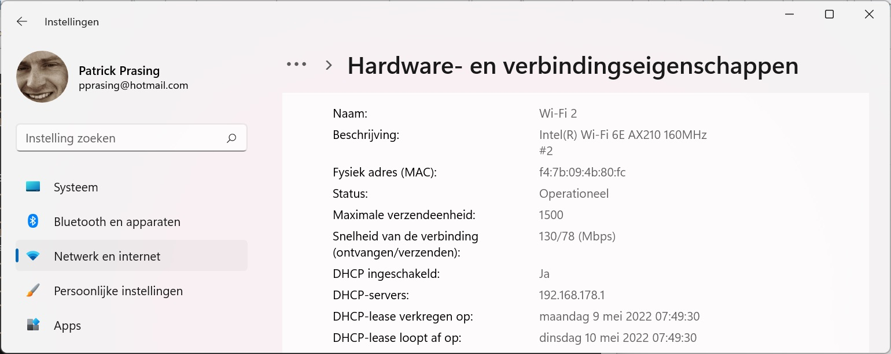

# [Network Devices]
Learn about different network devices and how to login to your router. 

## Key terminology
- network = Connection between 2 computers
- dhcp server = ( Dynamic Host Configuration Protocol) server that looks at the available IP-addresses and assignes the first available IP-address

## Exercise
### Sources
- https://nl.jf-parede.pt/what-are-network-devices
- https://infoblox.com/glossary/dhcp-server/ 
- https://serverfault.com/questions/293556/how-do-i-determine-what-my-dhcp-server-is
- https://geek-university.com/

### Overcome challanges
- What are network devices(netwerk apparaten)
- what is a dhcp server
- where can i find the command to find where my dhcp server is

### Results 1
- router = makes a connection between 2 networks and shares it over the other connected devices (layer 3 in OSI model)
- switch = maps mac adresses to different ports to its possible to track which package is send to which port  (layer 2 in OSI model)
- Bridge = divides the network in segments/domains but is less fast than a switch. modern LAN uses switches (layer 2 in OSI model)
- repeaters = send the connection signal further(repeats) similar as incomping or with a stronger signal
- access point = is used to access the internet over wifi (layer 1 in OSI model)
- Netwerkhub =  ports in device to send the network signal to other devices (layer 1 in OSI model)
- Modem = connects to the outside world, the internet (layer 1 in OSI model)

### Results 2
within the router you can find the connected devices. Next to the type of device you can also find: 
- mac address = unique id number that is given by the network 
- IP address = uniquenumber that is created that makes it possible to connect over the internet
- network speed = how fast your internet is
- how you are connected = Wireless or wired connection

### Results 3
Where is my DHCP server?  
via terminal:  
  

What are the configurations of my DHCP server  
  
