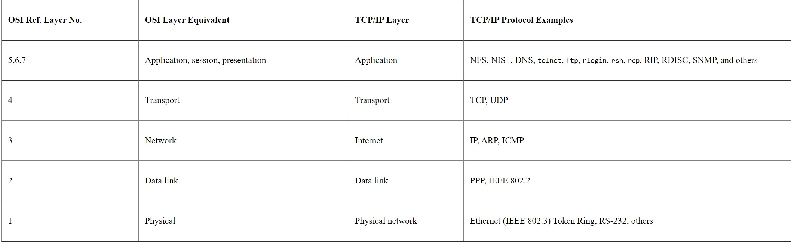
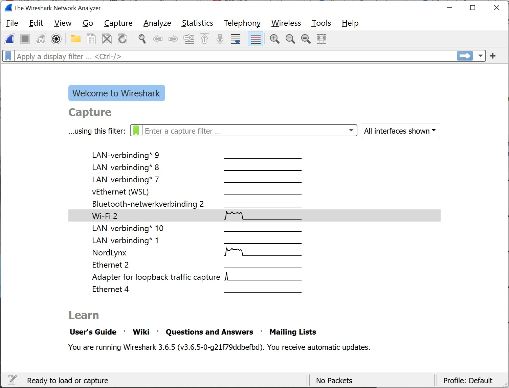
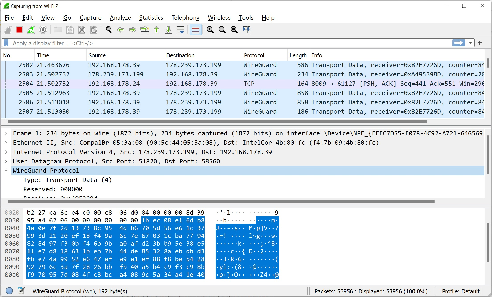

# [Protocols]
Protocols are neccesary to set rules to make a connection within devices

## Key terminology
protocol = rules the make a connection to transfer data in a structured way

## Exercise
### Sources
- https://docs.oracle.com/cd/E19683-01/806-4075/ipov-10/index.html
- https://afteracademy.com/blog/what-are-protocols-and-what-are-the-key-elements-of-protocols#:~:text=Some%20of%20the%20examples%20of,%2C%20TELNET%2C%20TFTP%2C%20etc.&text=Proprietary%20protocols%20are%20developed%20by,want%20to%20use%20their%20protocols.
- https://www.tutorialspoint.com/what-are-the-network-protocol-requirements-in-the-communication-process
- https://www.websense.com/content/support/library/web/v82/triton_web_help/add_protocol_explain.aspx
- https://www.wireshark.org/

### Overcome challanges
- What protocols are in which osi layer?
- what are the rules for setting up a protocol?
- what is Wireshark?

### Results 1

### Results 2
Mainly we can split up the protocols in 
- standard protocols are developed by a group of experts from different organisations
    - some examples : ftp, dns, dhcp, smtp, telnet and ;
- proprietary protocols are developed by an individual organization for their specific devices 
    - some examples : imessage, apple talk

For creating your own protocol it is neccesary 
- Set of procedures for handshaking
- Set of rules for interpreting the data sent
- Steps for recovery if communication is broken in the middle.

### Results 3
Wireshark is a network protocol analyzer. It lets you capture and interactively browse the traffic running on a computer network. It has a rich and powerful feature set and is world’s most popular tool of its kind.

