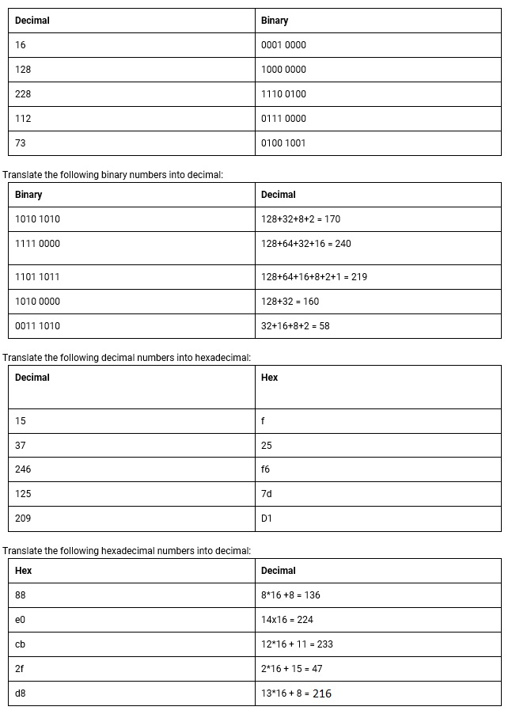

# [Counting in Binary and Hex]
Understanding the basic concepts of binary , decimal and hexadecimal

## Key terminology
Difference in counting systems
- Binary is base 2  (0/1)
- decimal is base 10 (0-9)
- hexadecimal is base 16 (0-9 + A-F)
- octal is a base 8 (0-7)(not for this exercise, just nice to know)

## Exercise
### Sources
https://www.rapidtables.com/convert/number/how-binary-to-decimal.html

### Overcome challanges
- what is the exact difference between Binary and Hex and how to calculate

### Results
Calculating in Binary requires a base of 2 to the power of x (2 tot de macht x), with 8 digits  
Calculating in Hexadecimal requires a base of 16 to the power of x (16 tot de macht x), with 2 digits    
  
Here is a screenshot of the exercise in translating into different counting system 

For future usage and translating: using windows calculator has a really good "programmer" mode to translate to any counting system 

