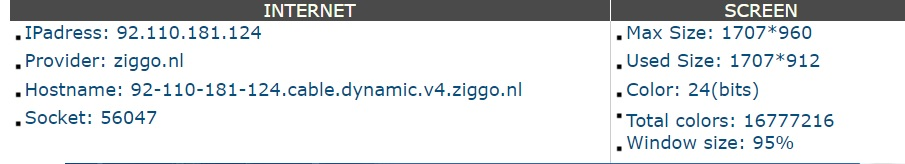
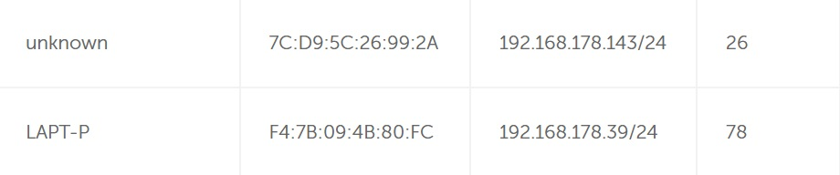

# [IP adressen]
What different type of ip-adresses are available and how are the assigned

## Key terminology
- IPv4 en IPv6 = standard for suppying public ip addresses
- Public IP address = the address that is used to give you internet
- Private IP address = the addresses that are given from the router to give internet to all of the devices within the network
- NAT
- Static IP address = an address that stays the same
- Dynamic IP adresses = the numbers if the IP address will rotate

## Exercise
### Sources
https://www.watismijnip.nl/

### Overcome challanges
[Give a short description of your challanges you encountered, and how you solved them.]

### Results
Public IP address 92.110.181.124 (laptop and mobile), these are the same , because every house address will only get 1 IP address. 

The private internal ip-adresses are different, so every device on the internal network can get connected to the public ip address

As far for the last exercise about changing the private IPadress i noticed that the original assigned ip address will be placed back in the list if i try to reserve an ip adres that is already used for my laptop. 

Further i don't really have the idea that i can change any ipadresses. I can allocate certain addresses for specific devices, but not change current ip addresses