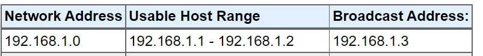
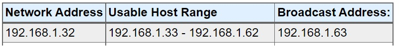
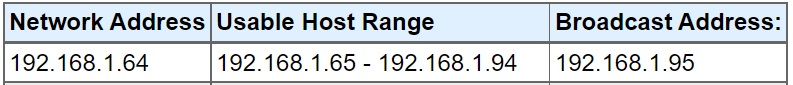
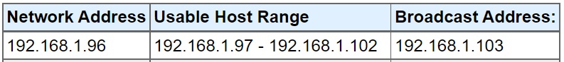

# [Subnetting]
We need to make an architecture diagram with multiple subnets

## Key terminology
- Subnet: we need to use subnets to group instances together according to your security and operational needs.
- Host: is a host that you would like to use in the cloud

## Exercise
### Sources
- https://www.uturndata.com/2021/02/23/aws-quick-tips-internet-gateways-nat-gateways-and-nat-instances/ 
- https://www.calculator.net/ip-subnet-calculator.html

### Overcome challanges
- how do you use a NAT within the vpc structure, dhould the NAT gateway be placed within the private subnet or a separate public subnet
- how does the subnet calculator work
- assigning IP addresses with a minimum for cost saving or scalability

### Results
Here you can find the diagram
    

It is important to notice that the amount of ip addresses neccesary could be set a minimum in terms of cost saving, but when scaling is important there is the option to set a higher ranges of IP addresses

Create 4 subnets: 
- The NAT gateway is  placed above the private subnet (1 IP address)
    - /30	255.255.255.252	2 (/30 creates 2 IP addresses)
    
- Private subnet with minimum 15 hosts (minimal 15 ip addresses)
    - /27	255.255.255.224	30 (/27 creates 30 IP addresses))
    
- Private subnet with minimum 30 hosts (minimal 30 IP addresses)
    - /26	255.255.255.192	62 (/26 creates 62 IP addresses)
    - /27	255.255.255.224	30 (/27 creates 30 IP addresses)
    
- Public subnet with minimum 5 hosts (minimum 5 IP addresses)
    - /28	255.255.255.240	14 (/28 creates 14 IP addresses)   
    - /29	255.255.255.248	6 (/29 creates 6 IP addresses)
    

The Internet Gateway is placed in the top of the VPC outside the subnets and has his own public IP address

