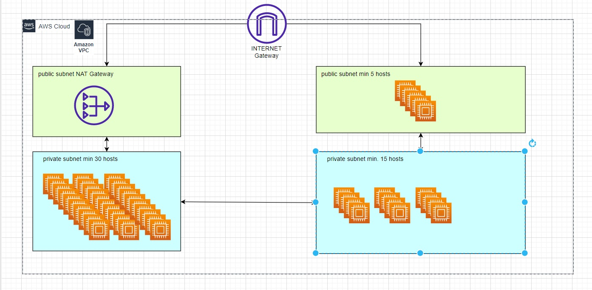
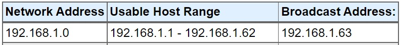

# [Subnetting]
We need to make an architecture diagram with multiple subnets

## Key terminology
- Subnet: we need to use subnets to group instances together according to your security and operational needs.
- Host: is a host that you would like to use in the cloud

## Exercise
### Sources
- https://www.uturndata.com/2021/02/23/aws-quick-tips-internet-gateways-nat-gateways-and-nat-instances/ 
- https://www.calculator.net/ip-subnet-calculator.html
- https://blogs.mulesoft.com/api-integration/security/how-to-choose-the-cidr-block-for-your-vpc/
- https://www.techtarget.com/searchnetworking/answer/Connecting-two-hosts-with-the-same-IP-address-but-different-subnet-masks#:~:text=Generally%20speaking%2C%20no%20two%20devices,on%20their%20same%20logical%20subnet.

### Overcome challanges
- how do you use a NAT within the vpc structure, dhould the NAT gateway be placed within the private subnet or a separate public subnet
- how does the subnet calculator work
- assigning IP addresses with a minimum for cost saving or scalability
- how many cidr notations are aloud within a LAN/VPC -> only 1 IPv4 an 1 IPv6
- do all IP addresses need to be unique, even within different subnets? -> Yes all IP addresses need to be unique

### Results
Here you can find the diagram
    

It is important to notice that the amount of ip addresses neccesary could be set a minimum in terms of cost saving, but when scaling is important there is the option to set a higher range of IP addresses

Create 4 subnets: 
- The NAT gateway is  placed above the private subnet (1 IP address)
- Private subnet with minimum 15 hosts (minimal 15 ip addresses)
- Private subnet with minimum 30 hosts (minimal 30 IP addresses)
- Public subnet with minimum 5 hosts (minimum 5 IP addresses)

So we need a total of 51 ip addresses, so we need to have a VPC with /26 what will create the possibility for max 62 hosts

    

- The NAT gateway is  placed above the private subnet (1 IP address)
192.168.1.1
- Private subnet with minimum 15 hosts (minimal 15 ip addresses)
192.168.1.2 - 192.168.1.16
- Private subnet with minimum 30 hosts (minimal 30 IP addresses)
192.168.1.17 - 192.168.1.46
- Public subnet with minimum 5 hosts (minimum 5 IP addresses)
192.168.1.17 - 192.168.1.21

The Internet Gateway is placed in the top of the VPC outside the subnets and has his own public IP address

