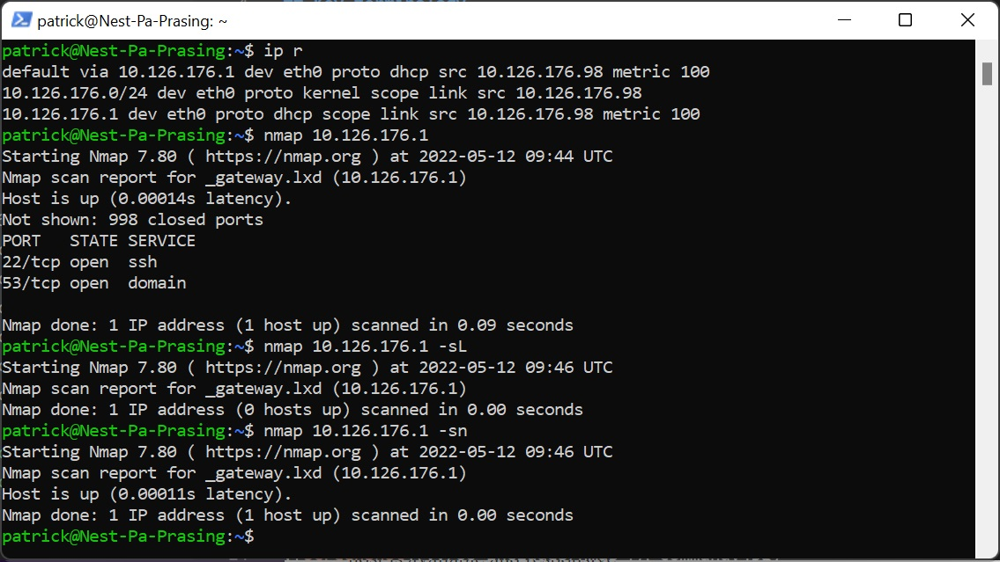
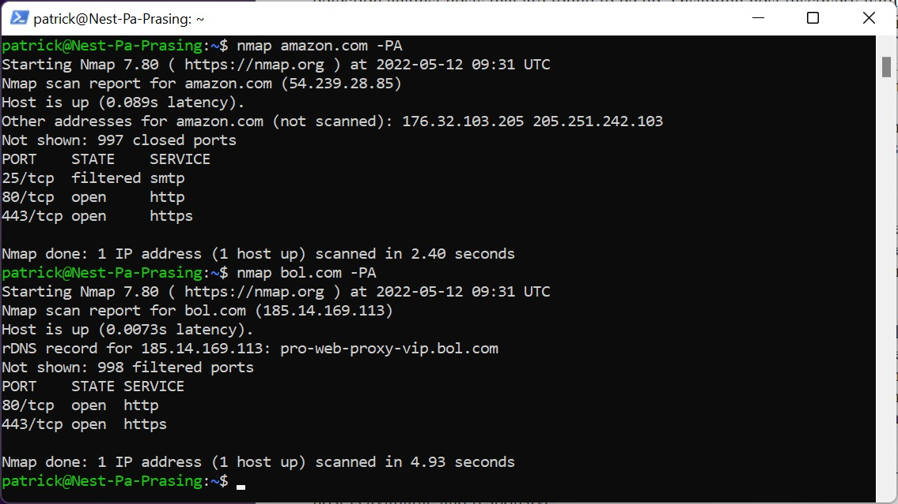
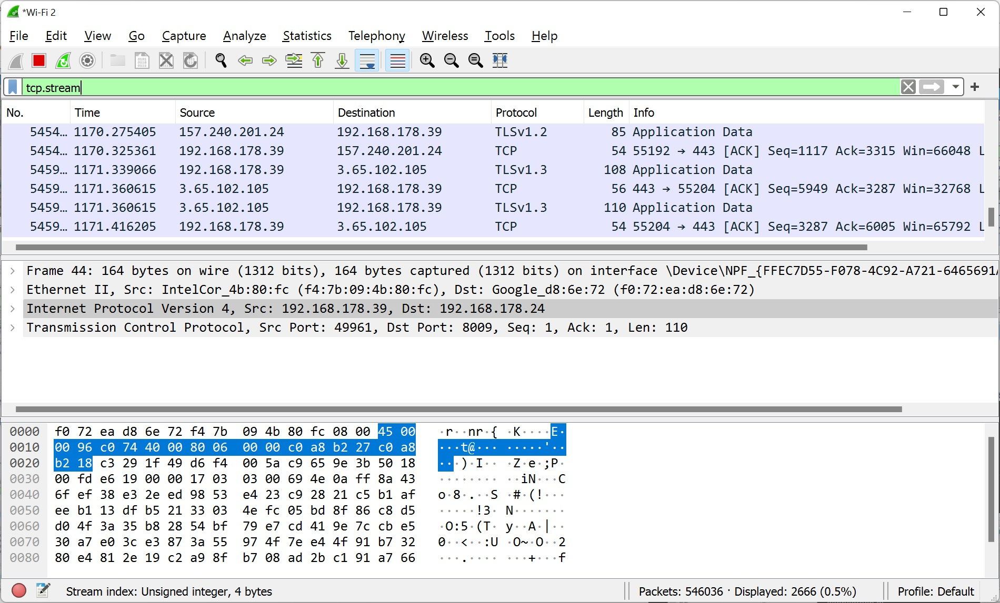
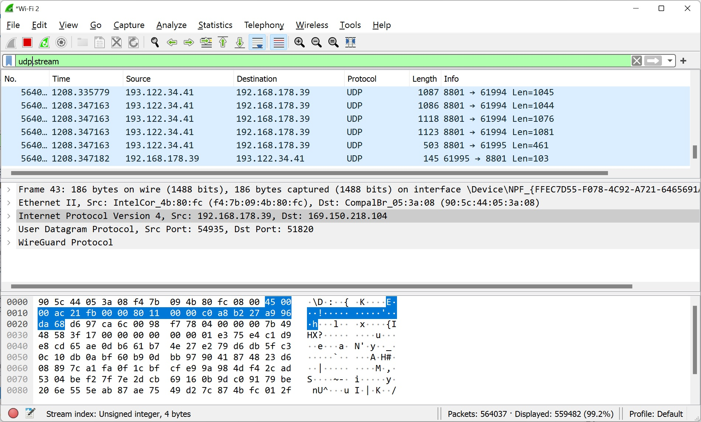

# [Network detection]
Find out what Nmap is and look at Wireshark

## Key terminology
- Wireshark: protocol analyzer
- Nmap:  Nmap is used to provide detailed, real-time information on your networks, and on the devices connected to them.

## Exercise
### Sources
- https://nmap.org/book/man.html
- https://www.varonis.com/blog/nmap-commands

### Overcome challanges
- install Nmap via sudo apt install nmap -y
- what is Nmap and how to use it

### Results
Here you can find a screenshot of nmap installed and the commands (notice there are no hosts running)
- ip r -> find your own ip address
- -sL -> list scan
- -sn -> No port scan

- -PA and with a port scan of amazon.com and bol.com

With Wireshark filter on TCP  

With Wireshark filter on UDP  
