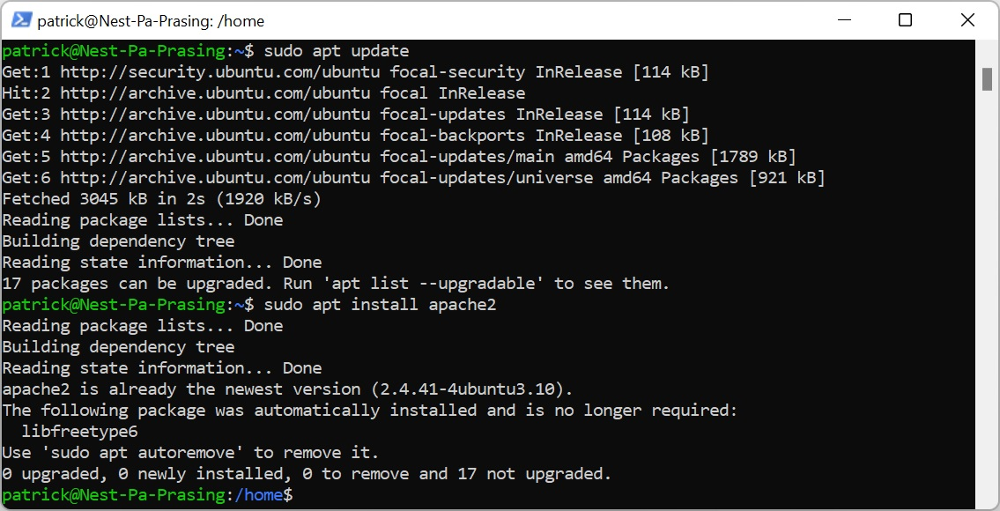
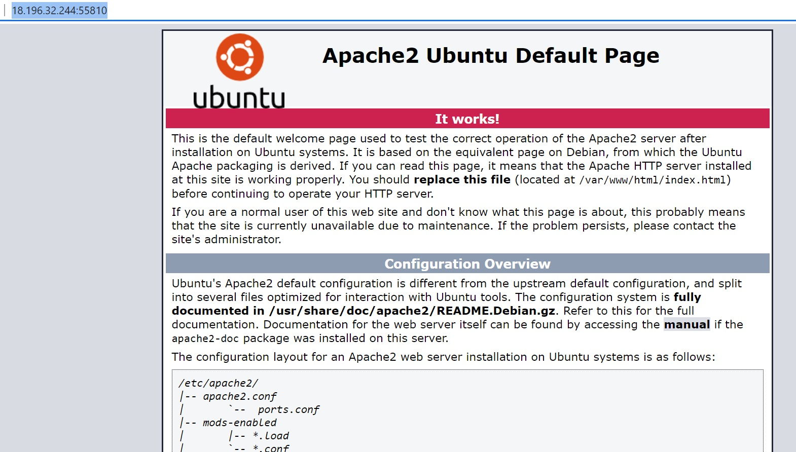
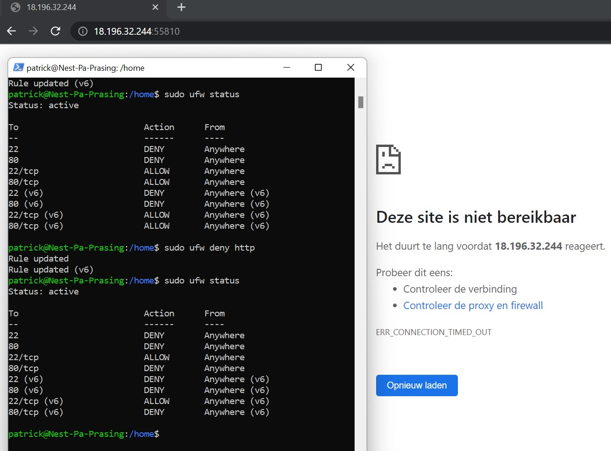

# [Firewalls]
What is a firewall and how can i open and close ports within a firewall

## Key terminology
- What is a firewall: a firewall is a network device used to scan and filter incoming and outgoing network traffic
- Stateful firewall: monitors all trafic that goes trough the network and can detect (future) threats, but is slower takes up more CPU and memory
- Stateless firewall: gives only permission by filtering incoming and outgoing packages on certain criteria

## Exercise
### Sources
- https://www.cybrary.it/blog/0p3n/stateful-vs-stateless-firewalls/
- https://docs.bitnami.com/virtual-machine/faq/administration/use-firewall/
- https://www.digitalocean.com/community/tutorials/ufw-essentials-common-firewall-rules-and-commands

### Overcome challanges
- What is the difference between stateless and statefull firewalls
- what webservers are there -> apache / IIS / lighttpd / sun / jigsaw
- how to find mine ip address 
    - ip addr OR hostname -i -> 10.126.178.98
- how to close and open ports
    - sudo ufw allow PORT (replace PORT by portnumber 80 or http)
    - sudo ufw deny PORT (replace PORT by portnumber 80 or http)

### Results

sudo apt update  
sudo apt install apache2  

Result that apache is configured correctly
http://18.196.32.244:55810/

Deny port 80 and there is no access anymore to website 
