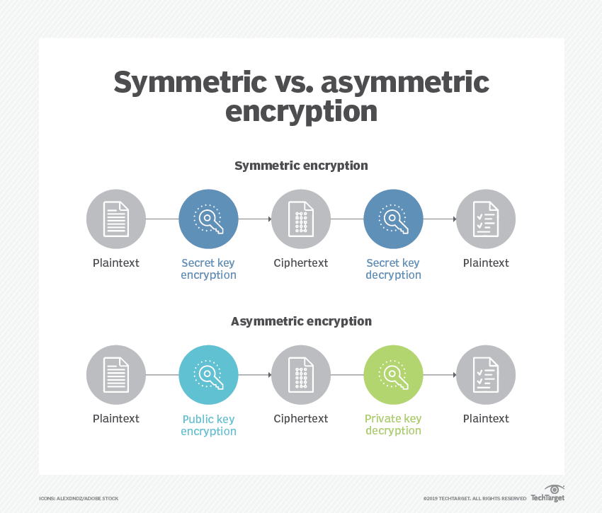
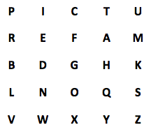

# [Symmetric encryption]
There different ways of encoding plain text with ciphers

## Key terminology
- data at rest: data that is stored locally on your computer
- data in motion: data that is send by transferring it online
- Cipher: transform code into something you can't read  
- Caesar cipher: a method where plain text is transformed into a certain letters of the alphabet with the number -3 down the alphabet
- Caesar cipher(modified verion): a method where plain text is transformed into certain letters of the alphabet with a chosen number down the alphabet -6 or -2 or -1
- Cryptography: transform text in a unreadable text
- Symmetrical encryption vs A-symmetrical encryption  
with symmetrical encryption you use the same key to decrypt and encrypt the message, while with asymmetrical encryption you will use a different key to encrypt and decrypt

## Exercise
### Sources
- [Hystoric ciphers](https://www.secplicity.org/2017/05/25/historical-cryptography-ciphers/)
- [Types of ciphers](https://www.educba.com/types-of-cipher/)
- [what are ciphers](https://www.techtarget.com/searchsecurity/definition/cipher)
- [digital cipers](https://blog.storagecraft.com/5-common-encryption-algorithms/)
- [SHHLACK for encrypted messages on slack](https://www.vice.com/en/article/43bj8w/slack-end-to-end-encryption-shhlack-boss-cant-read-messages)
- [RSA encryption key generator](https://www.devglan.com/online-tools/rsa-encryption-decryption)
- [aes encryption key generator](https://cryptotools.net/aes)

### Overcome challanges
- what are ciphers?
- How can we send an encrypted symmetrical message

### Results
- Two more historic ciphers besides the Caesar cipher
    - Vigenère Cipher: uses a table to encode 
    
    - Playfair Cipher: uses a 5x5 table with rules to encode
    

- (Two) digital ciphers (A-Symmatrical) that are being used today
    - Triple DES (Data Encryption Standard)
    - AES (Advanced Encryption Standard)
    - Blowfish
    - Twofish

- while sending a symmetrical message you always need to send the encryption method so another person can easily use the encryption.
Shortcoming this is not available when there is no communication possible
    - there is a possibility within slack to install a patch to send encrypted messages with SHHLACK. i installed the chrome extension, but this doesn't work sofar. Anyway still even then there needs to be a communication for a password.

This is a screenshot of aes public key and encryption

IT IS POSSIBLE WITH A DIFFIE HELLMAN KEY EXCHANGE.  
when generated a shared secret(public key) then you can use this for Symmatric AES encryption  

