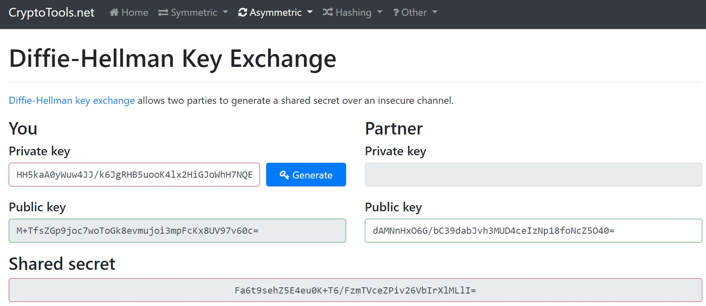
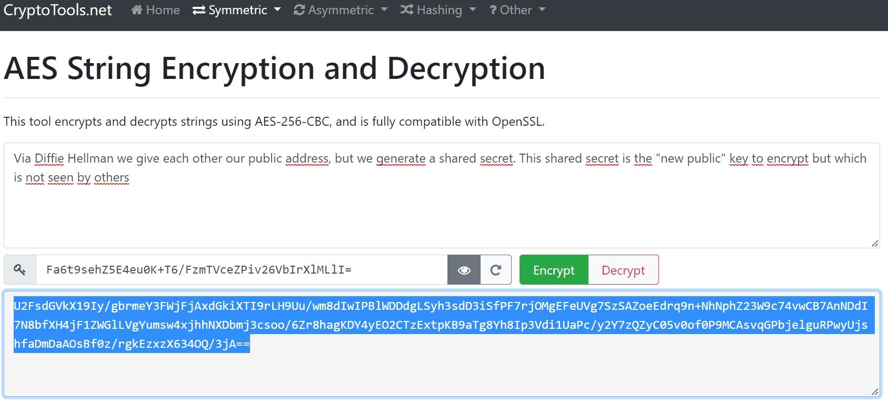
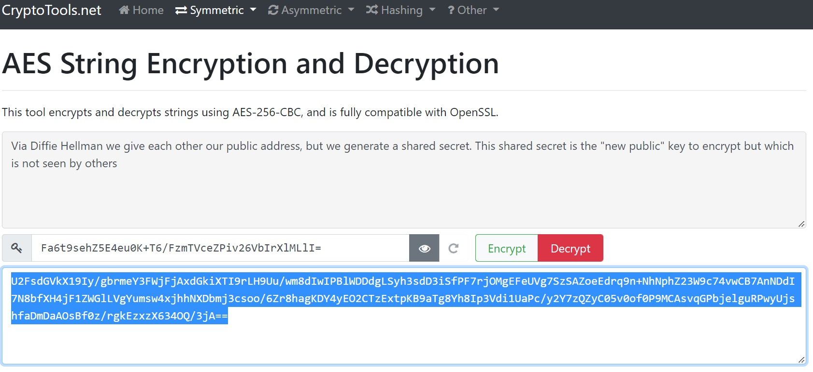

# [Asymmetric encryption]
How can you send a message without sending the key with which you can encrypt it?

## Key terminology
- what is Asymmetric encryption: with the use of private and public key instead of only public keys
- Diffie Hellman encryption: a way by sharing a public key and generating another key to unlock the encryption

## Exercise
### Sources
- https://cryptotools.net/aes

### Overcome challanges
We used the cryptotools website to encrypt via Diffie Hellman and then used AES to encrypt

### Results
- Get the public key from the person with how you want to share with

- The one with who you want to share with has to enter your public key and this generates the same "shared secret" that you can use to encode or decode the AES encryption. Nobody will know this  

- First encrypt the message with aes  

- then decrypt the message with aes

