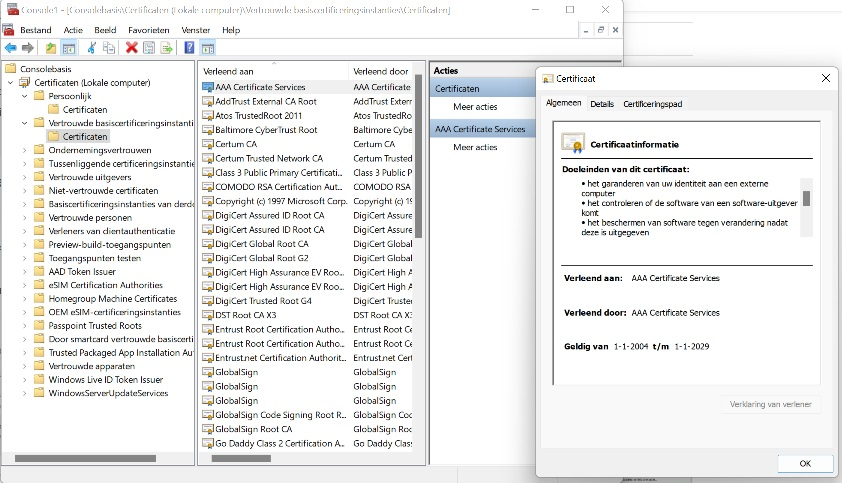

# [Public Key Infrastructure]
Find out what a PKI is and how certificats are created

## Key terminology
- PKI: Public Key Infrastructure. A PKI certificate is a digitally signed document that is comparable with a physical identity card or a passport used in the analog world.
- X.509: is the standard which defines the process in which a PKI should function  

- The 3 entities
    - Digital Certificates: for internal communications
    - Certificate Authority: thrird party for commercial usage 
    - Registration Authority: third party provide digital certificates to users on a case-by-case basis

## Exercise
### Sources
- [What is a pki](https://www.primekey.com/wiki/what-is-a-pki-certificate/)
- [how does pki work](https://www.venafi.com/education-center/pki/how-does-pki-work)
- [X.509 standard](https://www.appviewx.com/education-center/what-is-x-509-standard/#:~:text=509%20Standard%3F-,X.,offline%20applications%2C%20like%20electronic%20signatures.)
- [How to create a self signed certificate](https://devopscube.com/create-self-signed-certificates-openssl/)
- [Create a certificate on ubuntu](https://websiteforstudents.com/how-to-create-self-signed-certificates-on-ubuntu-linux/)
- [how to check certificates in windows](http://woshub.com/updating-trusted-root-certificates-in-windows-10/)
- [how to check certificates in ubuntu/powershell](https://unix.stackexchange.com/questions/97244/list-all-available-ssl-ca-certificates)

### Overcome challanges
- What is a PKI certificate  
Self assigned SSL

CA assigned SSL

### Results
- Create your own certificate

And the result:  

- Screenshot of a certificate

- screenshot after running mmc.exe on windows, see all certificates

- BONUSPOINTS: Screenshot after running vm, see all certificates in 
    - Key files go into /etc/ssl/private  
    - System-provided actual files are located at /usr/share/ca-certificates  
    - Custom certificates go into /usr/local/share/ca-certificates  

