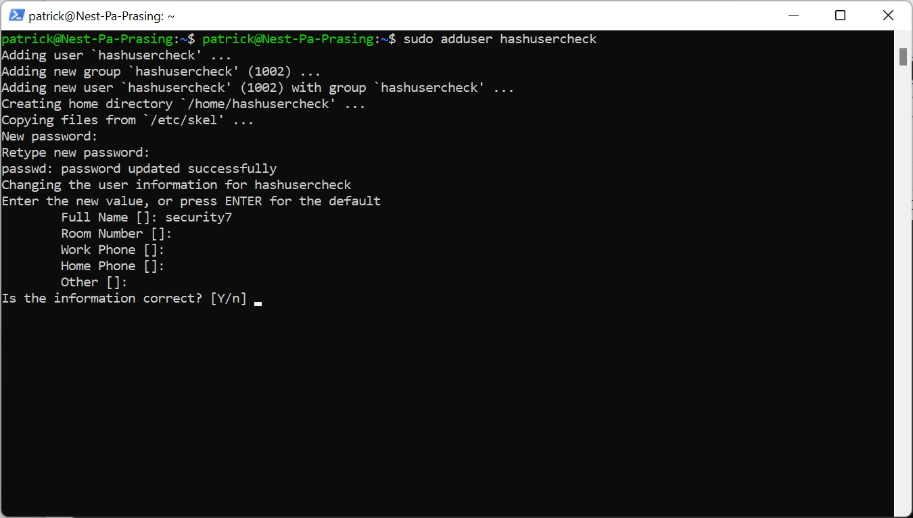
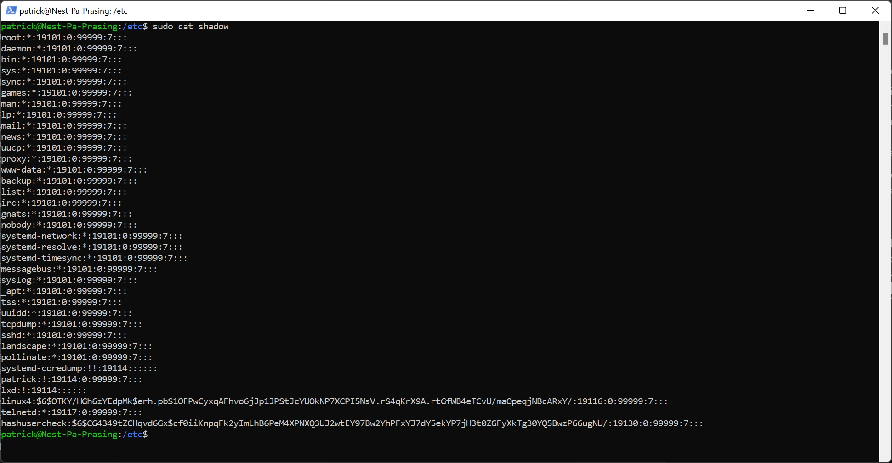
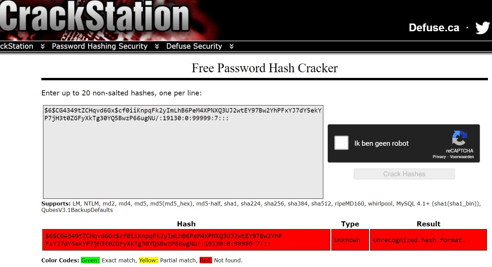
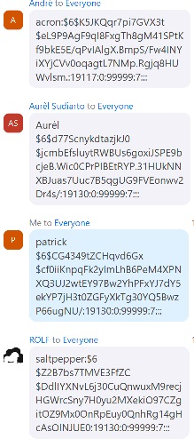

# [Network Detection]
What is hashing and how can you use a rainbow table for common used passwords

## Key terminology
- Hashing: turnin any amount of data into a fixed-length "fingerprint" that cannot be reversed (password becomes a hash)
- Lookup table: is a extremely effective method for cracking many hashes of the same type very quickly. The general idea is to pre-compute the hashes of the passwords in a password dictionary and store them, and their corresponding password, in a lookup table data structure
- Rainbow table: are a time-memory trade-off technique. They are like lookup tables, except that they sacrifice hash cracking speed to make the lookup tables smaller. Because they are smaller, the solutions to more hashes can be stored in the same amount of space, making them more effective
- salted password hashing: adding extra random letters(salt) to a password to create a different hash
- dictionary attacks : containing words, phrases, common passwords, and other strings that are likely to be used as a password
- brute-force attacks: tries every possible combination of characters up to a given length

## Exercise
### Sources
- [Difference between hashing and encryption](https://www.baeldung.com/cs/hashing-vs-encryption)
- [Rainbow table website](https://crackstation.net/)
- [What is a rainbow table attack](https://www.beyondidentity.com/glossary/rainbow-table-attack#:~:text=The%20rainbow%20table%20itself%20refers,quickly%20with%20a%20rainbow%20table.)

### Overcome challanges
- How is the rainbow table used
- We were wondering if you could see a basic layout when a salt is used

### Results
- Why woud you prefer hashing over symmetrical encryption for storing passwords?
    - Both of these techniques change the raw data into a different format. Hashing on an input text provides a hash value, whereas encryption transforms the data into ciphertext. Hashing is not reversable while a symmetrical encryption can be decrypted with a public key 

- How can a rainbow table be used to crack hashed passwords
    - Once the hashed password of a website or application is leaked, you can look up if the hashed password excists in the rainbowtable and if there is a similar hash there is a password text phrase available

- Enter the 2 given hashes and see what happens  
    - 03F6D7D1D9AAE7160C05F71CE485AD31 : welldone!
    - 03D086C9B98F90D628F2D1BD84CFA6CA : Not found.

- Here you can i created a new user with password 12345  

In the etc directory cat file shadow and look up the hashed password

- Check if the hash exists in the rainbowtable, as you can see it does not exists because there is a salt added the hash of 12345 is different   

- Now look up the hash of another peer for this 12345 password hash
 