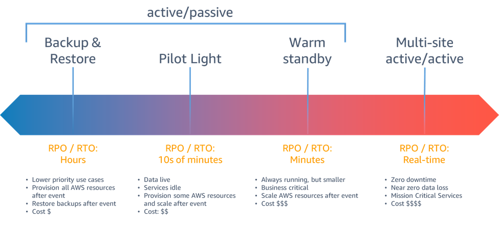

# [Detection, response and analysis]
What is the difference betweens RPO and RTO and how can you check up systems to look for anomalies

## Key terminology
- RPO(Recovery Point Objective): How much data is lost on incident 
- RTO(Recovery Time Objective): how long it takes to be back online
- IDS(intrusion detection system): classifications
    - Network intrusion detection systems (NIDS): A system that analyzes incoming network traffic.
    - Host-based intrusion detection systems (HIDS): A system that monitors important operating system files.
    - IDS types:
        - Signature-based: Signature-based IDS detects possible threats by looking for specific patterns, such as byte sequences in network traffic, or known malicious instruction sequences used by malware. This terminology originates from antivirus software, which refers to these detected patterns as signatures. Although signature-based IDS can easily detect known attacks, it is impossible to detect new attacks, for which no pattern is available.
        - Anomaly-based: a newer technology designed to detect and adapt to unknown attacks, primarily due to the explosion of malware. This detection method uses machine learning to create a defined model of trustworthy activity, and then compare new behavior against this trust model. While this approach enables the detection of previously unknown attacks, it can suffer from false positives: previously unknown legitimate activity can accidentally be classified as malicious.
- IPS (intrusion prevention system): IPS can prevent security threats with direct actions taken, while IDS only provides information(monitors).
- Hack response strategies
    1. Follow a communication plan.
    2. Secure IT systems.
    3. Launch backups.
    4. Notify authorities.
    5. Create redundancy in your data.  

- systems hardening: reduce vulnerability in technology applications etc.
    - Application hardening
    - Operating system hardening
    - Server hardening
    - Database hardening
    - Network hardening   

- Different types of disaster recovery options
    - Data Center Disaster Recovery
    - Cloud-Based Disaster Recovery
    - Virtualization Disaster Recovery
    - Disaster Recovery as a Service  
    **AWS options**
 

## Exercise
### Sources
- [IDS](https://www.barracuda.com/glossary/intrusion-detection-system)
- [IPS and the difference with IDS](https://www.exabeam.com/ueba/ips-security-how-active-security-saves-time-and-stop-attacks-in-their-tracks/)
- [Disastar Recoveryoptions of AWS](https://docs.aws.amazon.com/whitepapers/latest/disaster-recovery-workloads-on-aws/disaster-recovery-options-in-the-cloud.html)
- [What to do when you get hacked](https://securityboulevard.com/2019/11/5-tips-for-responding-to-cyber-attacks/)

### Overcome challanges
- What is exactly the difference between IDS and IPS
- What are the options in AWS to restore data

### Results
- The RPO of the database is :
    - While the backup is made automatically when the failure happened using the most recent available backup, the only data that is lost is the data that has been added of the last 15 minutes, while it needs to be recovered to the original database of which the entire process takes 15min. The maximum amount of data lost is 24hours, while there is a daily backup.

- The RTO of the website is 8 minutes, while it takes 8 minutes to get the website back online assuming the process is the "entire" process