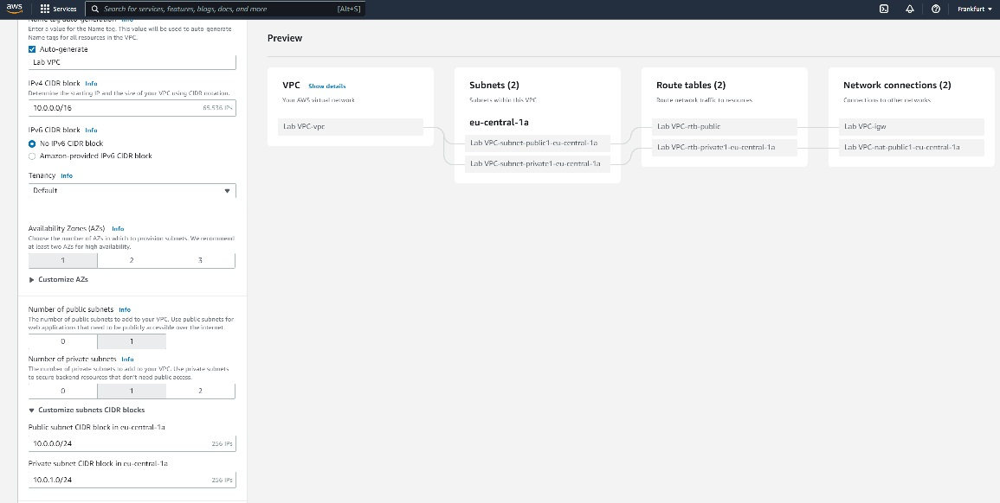
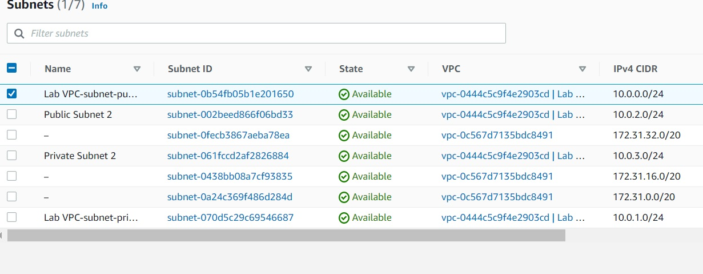
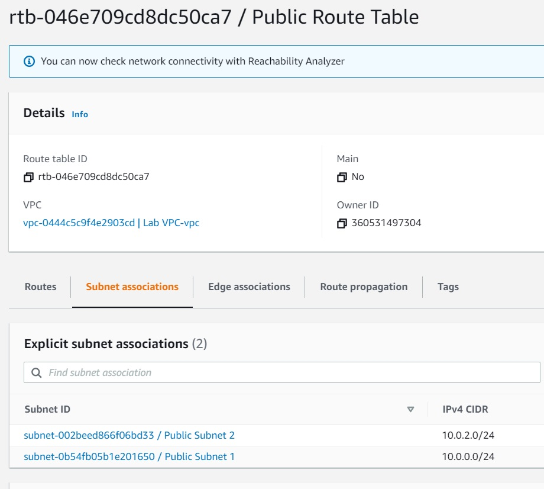
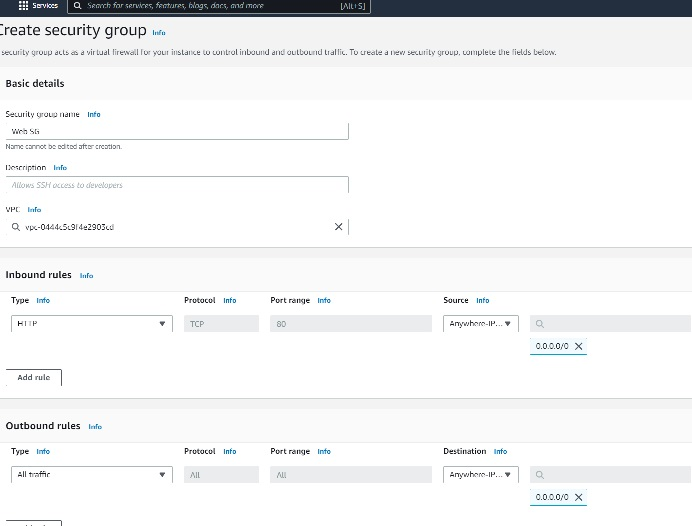
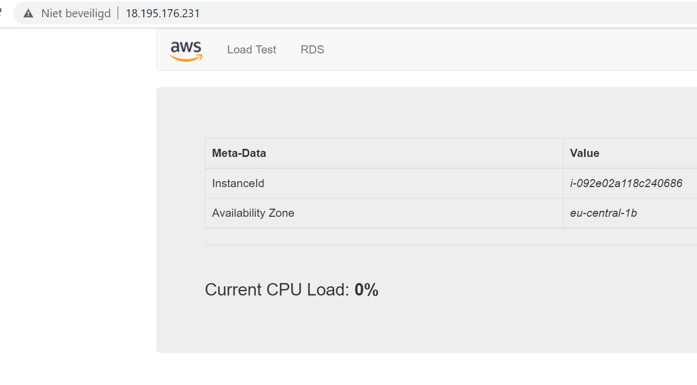
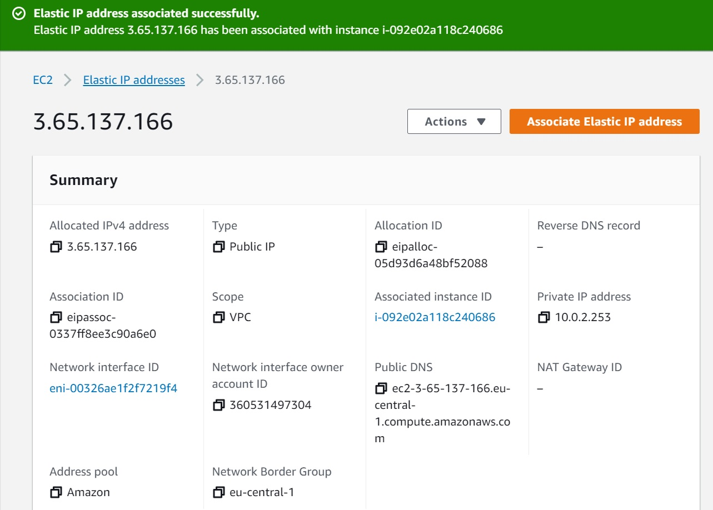
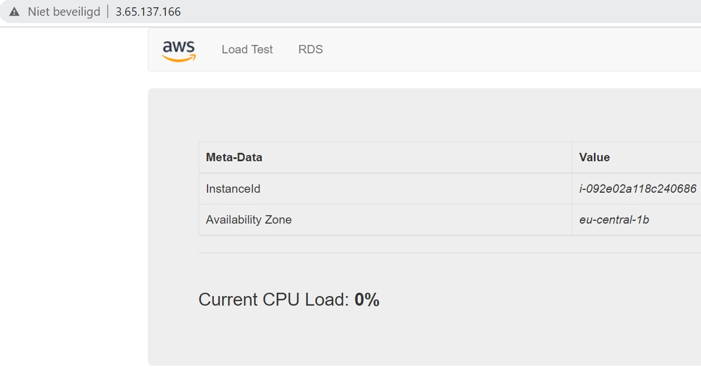

# VPC
Set up a vpc with public and private subnets. Add a security group and connect to a EC2 instance in the public subnet

## Key terminology
...

## Exercise
### Sources
none

### Overcome challanges
- customize subnet cidr.
- change the name of the routetables and subnets by changing the tag

### Results
**Exerise 1:**  
Created a vpc with the wizard

**Exerise 2:**  
Add 2 subnets without the wizard (Public Subnet 1 + Private Subnet 2)

Associate 2 private subnets to the private route table

Associate 2 public subnets to the public route table

**Exerise 3:**  
Add security group

**Exerise 4:**  
Create EC2 instance and connect to IPv4 link 18.195.176.231 (without SSL!!!!)

**Elastic IP association exercise:**  
Connect the elastic IP address to the instance

