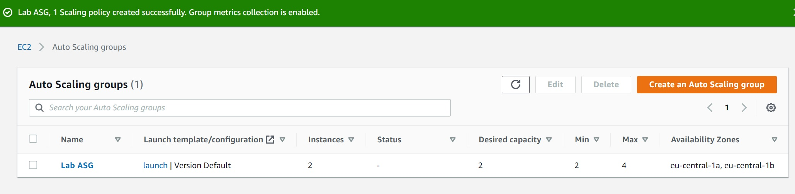

# ELB en Auto Scaling
See how to work with a load balancer , setting up scaling groups and do a load performance test

## Key terminology
..

## Exercise
### Sources
https://docs.aws.amazon.com/autoscaling/ec2/userguide/what-is-amazon-ec2-auto-scaling.html

### Overcome challanges
- speed up the Default cooldown in scaling group from 300 to 20sec, to get a faster result to see if the instances are beeing scaled up

### Results 
**Exercise 1**  
Create ami  

**Exercise 2**  
Create alb  

**Exercise 3**  
After creating a launch template i created an auto scaling group 

**Exercise 4**  
Instances are up and running , target are set correctly

Check via DNS of loadbalancer and refresh to see if different instances are beeing assigned

Check if all 4 instances are created because of 60%+ CPU performance on servers(i changed the waiting time from 300sec to 20sec, to speed it up) 

